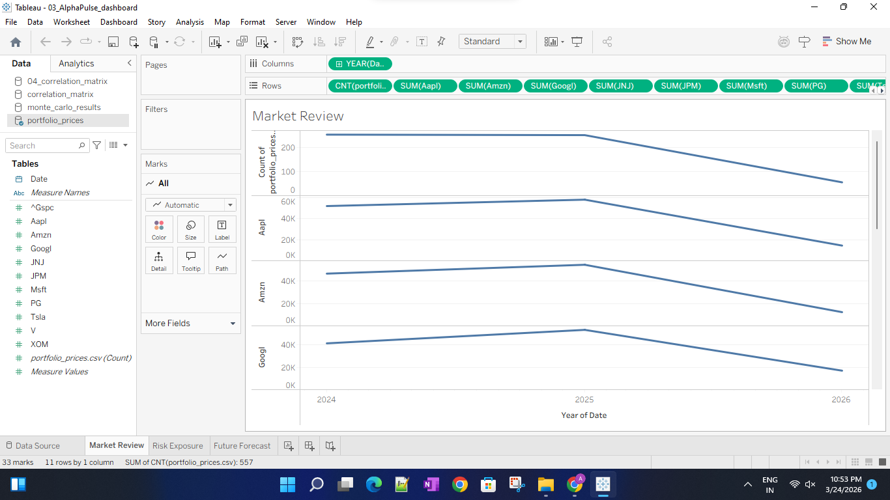
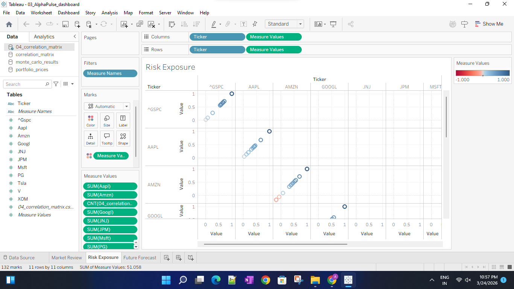

# AlphaPulse-Financial-Monitor
An investment risk monitor using Monte Carlo simulations and Tableau.
# 📈 AlphaPulse: Institutional Investment Risk & Volatility Monitor

**AlphaPulse** is a high-fidelity financial analytics engine developed to provide boutique investment firms with a real-time, data-driven view of portfolio risk exposure. By leveraging stochastic modeling and interactive visualizations, the platform transforms raw market data into actionable risk insights.

---

## 👤 Project Overview
* **Project Type:** Individual Capstone Project
* **Developer:** Amna Bi Hafeez
* **Domain:** Financial Technology (FinTech) & Data Analytics
* **Date:** March 2026

---

## 🚀 Core Functionalities

### 📊 Dashboard Gallery (Visual Insights)
*Below are the production-ready views from the AlphaPulse Tableau Engine. These visualizations provide executive-level oversight of market risk.*

#### 1. Strategic Portfolio Risk Overview


#### 2. Quantitative Volatility Analysis & Correlation Matrix


#### 3. Monte Carlo Simulation & Stochastic Forecasting
.png)

---

### 1. Advanced Quantitative Modeling
* **Monte Carlo Simulation:** Executed 10,000 iterations to forecast a 1-year probability-based performance distribution.
* **Value at Risk (VaR):** Calculated at a 95% confidence level to establish a maximum expected loss threshold.
* **Logarithmic Returns:** Utilized log returns for statistical normality and time-additivity in long-term volatility forecasting.

### 2. Dynamic Risk Visualizations (Tableau)
* **Correlation Heatmaps:** Interactive matrices identifying systemic asset dependencies to optimize portfolio diversification.
* **Rolling Volatility:** 30-day moving standard deviation monitoring to track market uncertainty regimes.
* **"What-If" Analysis:** Parameterized stressors allowing users to simulate market shocks in real-time.

### 3. Data Science Research (Jupyter)
* A dedicated research notebook providing a granular breakdown of the mathematical proofs, statistical distributions, and correlation logic used in the production engine.

---

## 🛠️ Technical Stack

| Component | Technology | Purpose |
| :--- | :--- | :--- |
| **Language** | Python 3.x | Core Logic & ETL |
| **Data Source** | yfinance API | Real-time Market Data Acquisition |
| **Mathematics** | NumPy | High-speed Matrix Multiplications & Cholesky Decomposition |
| **Data Processing**| Pandas | Time-series Cleaning & Transformation |
| **Analytics** | Jupyter Notebook | Quantitative Research & Validation |
| **Visualization** | Tableau Desktop | Executive-level BI Dashboarding |

---

## 📁 Project Structure

* `01_AlphaPulse_Engine.py`: The primary ETL and Quantitative Engine.
* `02_AlphaPulse_Analysis.ipynb`: Statistical research and Matplotlib/Seaborn visualizations.
* `03_AlphaPulse_Dashboard.twb`: The final production-ready Tableau workbook.
* `data/`: Directory containing generated financial datasets (CSV format).

---

## ⚙️ Setup & Execution

1.  **Environment Setup:**
    ```bash
    pip install yfinance numpy pandas matplotlib seaborn
    ```
2.  **Data Generation:** Run `01_AlphaPulse_Engine.py` to refresh market data and re-run simulations.
3.  **Research Review:** Open `02_AlphaPulse_Analysis.ipynb` to view the quantitative validation.
4.  **Dashboard Access:** Load `03_AlphaPulse_Dashboard.twb` in Tableau to interact with the high-level KPIs.

---
**Developed by Amna Bi Hafeez | Financial Risk Management Portfolio 2026**
